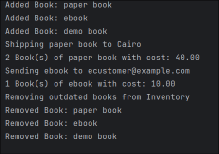
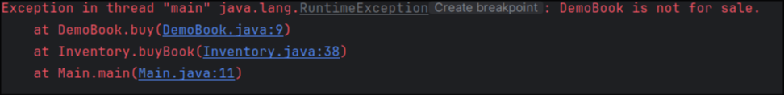
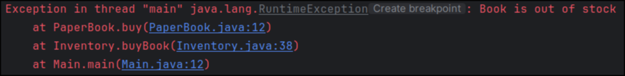
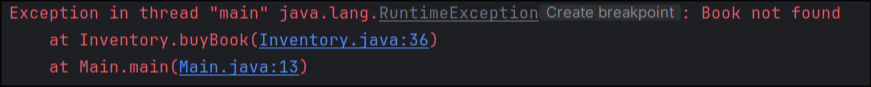

Full Inventory View: Shows the main inventory list when all book types (PaperBook, EBook, DemoBook) are loaded and how tansactions done.

Demo View: shows a DemoBook in the inventory where purchase controls are disabled and “Not for sale” messaging appears.

Low Stock Alert View: shows a PaperBook entry with low or zero stock, triggering the “out of stock” error.

Not Found: shows the error message shown when trying to buy or  book by an ISBN that doesn’t exist in the inventory.

